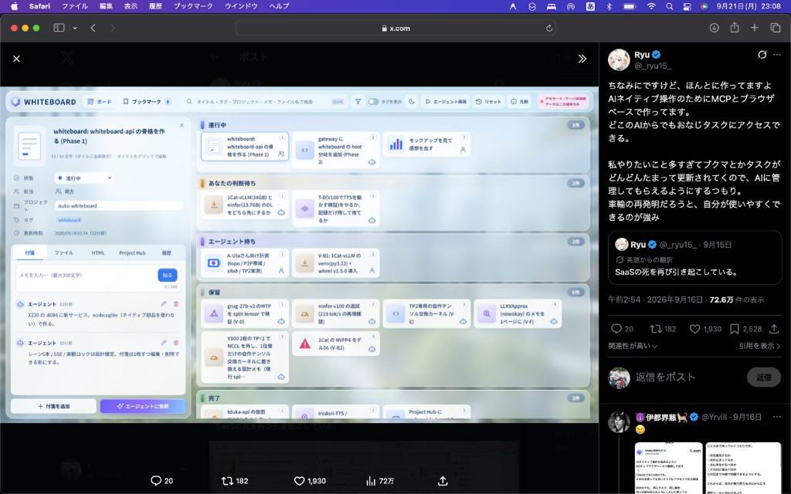

# WHITEBOARD - AI Native Task & Thought Board

人間とAIエージェント（Antigravity、Gemini、Claude Desktop、Cursor、ChatGPT等）が共通して読み書きできる、AIネイティブなタスク・思考管理カンバンボードシステム。



---

## 主な特徴

* 🤖 **AIネイティブ（MCP準拠）**:
  * 業界標準の **MCP（Model Context Protocol）** サーバーを内蔵。Antigravity、Claude Desktop、Cursor等からツールとして呼び出し、自律的にタスク確認・起票・移動・メモ貼付が可能。
* 📡 **リアルタイム同期（SSE）**:
  * Server-Sent Events（SSE）により、外部AIエージェントがタスクを変更した瞬間にブラウザ側へプッシュ配信され、リロードなしで画面がリアルタイムに更新されます。
* 📋 **洗練されたカンバンUI（6本レーン設計）**:
  1. `進行中`: 現在リアルタイムに作業中のタスク
  2. `あなたの判断待ち`: AIが人間に意思決定・回答を仰ぐタスク
  3. `エージェント待ち`: AIエージェントが実行を担当するタスク
  4. `保留`: バックログ・一時保留・調査待ち
  5. `完了`: 完了したタスク
  6. `アイデア / 未着手`: 今後の着想・ブックマーク
* 📝 **タスク詳細 & 付箋（メモ）システム**:
  * 300文字以内の付箋メモ。人間・AIの投稿者バッジ、相対時間、インライン編集・削除機能。
  * タイトルのインライン編集（60文字カウンター付き）。
* 🔍 **高速クイック検索（`Ctrl + K` / `⌘ + K`）**:
  * タイトル、プロジェクト、タグ、メモをキーボード操作のみで横断検索。
* 🔒 **楽観的ロック（Optimistic Concurrency Control）**:
  * 人間とAIが同時に同一タスクを編集した際のデータ上書き・競合を自動防止。
* 🪶 **ネイティブ部品ゼロ（WASM SQLite `sql.js`）**:
  * 古いPCやOSでもC++コンパイルエラーやセグフォが起きない純粋WebAssembly版SQLiteを採用。ファイル1つでポータブルに永続化。

---

## クイックスタート

### 動作要件
* Node.js v18 以上（Node.js v20 推奨）
* 追加の外部言語やデータベースサーバー、Dockerは一切不要です。

### 起動手順

```bash
# 1. 依存関係のインストール
npm install
cd server && npm install
cd ../client && npm install
cd ..

# 2. ビルド
npm run build

# 3. サーバー起動
npm start
```

ブラウザで **`http://localhost:8086`** を開いてください。

---

## MCP（Model Context Protocol）接続

各AIツールから本システムのMCPサーバーへ接続できます。

* **実行スクリプト**: `server/dist/mcp/runMcp.js`

### Claude Desktop / Cursor の設定例
```json
{
  "mcpServers": {
    "whiteboard": {
      "command": "node",
      "args": [
        "/絶対パス/fervent-hypatia/server/dist/mcp/runMcp.js"
      ]
    }
  }
}
```

詳細な設定手順は [MCP設定ガイド](docs/ai_whiteboard_system/mcp_setup_guide.md) をご覧ください。

---

## ドキュメント

* [タスクリスト (task.md)](docs/ai_whiteboard_system/task.md)
* [実装計画書 (implementation_plan.md)](docs/ai_whiteboard_system/implementation_plan.md)
* [完成ウォークスルー (walkthrough.md)](docs/ai_whiteboard_system/walkthrough.md)
* [MCP設定ガイド (mcp_setup_guide.md)](docs/ai_whiteboard_system/mcp_setup_guide.md)
